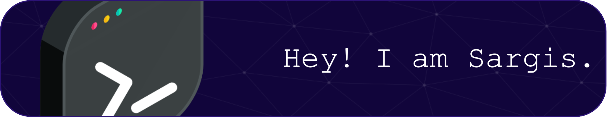

I've been making professional and amateur games for the past 6 years!

- 💻 I'm currently looking for new career opportunities. I highly prefer working in the games industry, however, I keep an open mind ...
- 🔭 Right now, I'm busy revising my GitHub projects and building a portfolio site to showcase my work ...
- 🌱 Along with that, I'm learning NeoVim and Unix systems. In the near future I'd like to learn advanced C++ and graphics programming ...
- 📘 Currently pursuing a Bachelor's degree in Computer Science at UoPeople ...
- 🎮 I like creating open source games or tools on rare occasions ...
- 📫 How to reach me: LinkedIn profile link is in my bio!
-->

## Here are some tools that I have used or am I using currently

