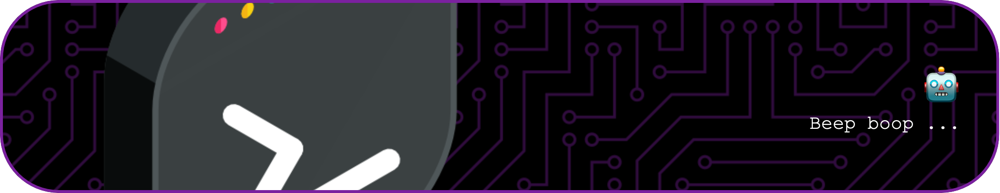

I am a game developer with 6+ years of experience in creating amateur and professional games.

Here is some brief information about me;

- 💻 I'm currently looking for new career opportunities. I highly prefer working in the games industry, however, I keep an open mind ...
- 🔭 At the moment, I'm working on revising my GitHub projects and creating a portfolio website ...
- 🌱 Nowadays, I spend my spare time learning NeoVim and Unix systems. In the future I'd like to learn advanced C++ and graphics programming ...
- 📘 Pursuing a Bachelor's degree at UoPeople ...
- 📫 How to reach me: Check out my LinkedIn profile link in my bio!
-->

## Here are some tools that I have used or am I using currently

